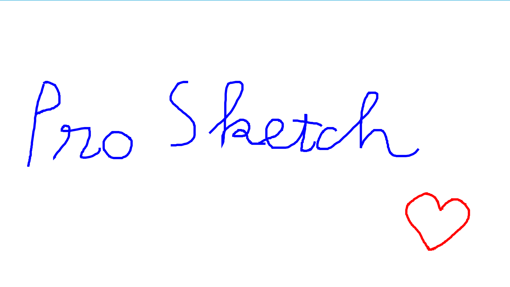
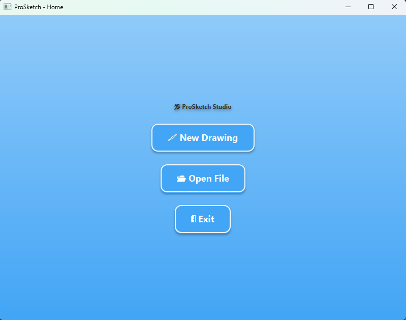
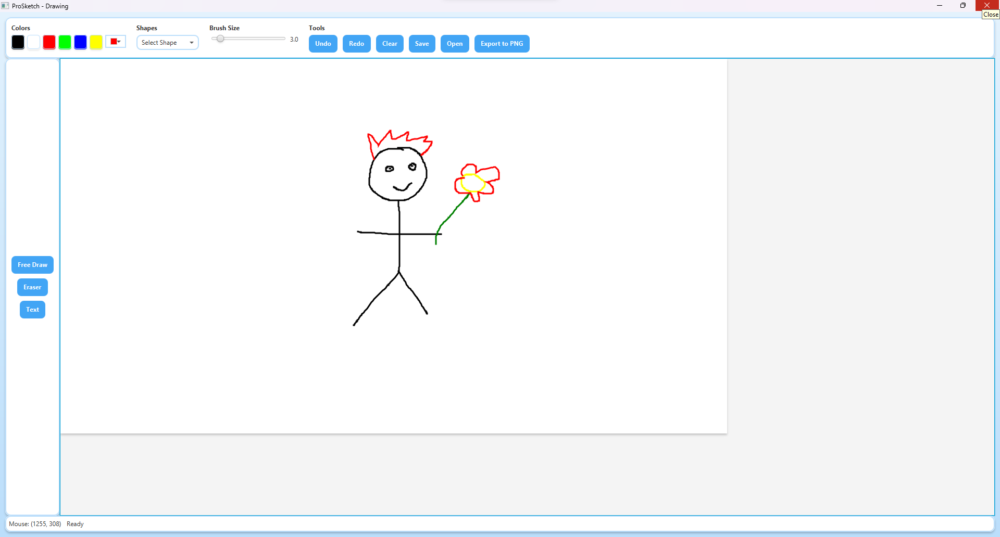
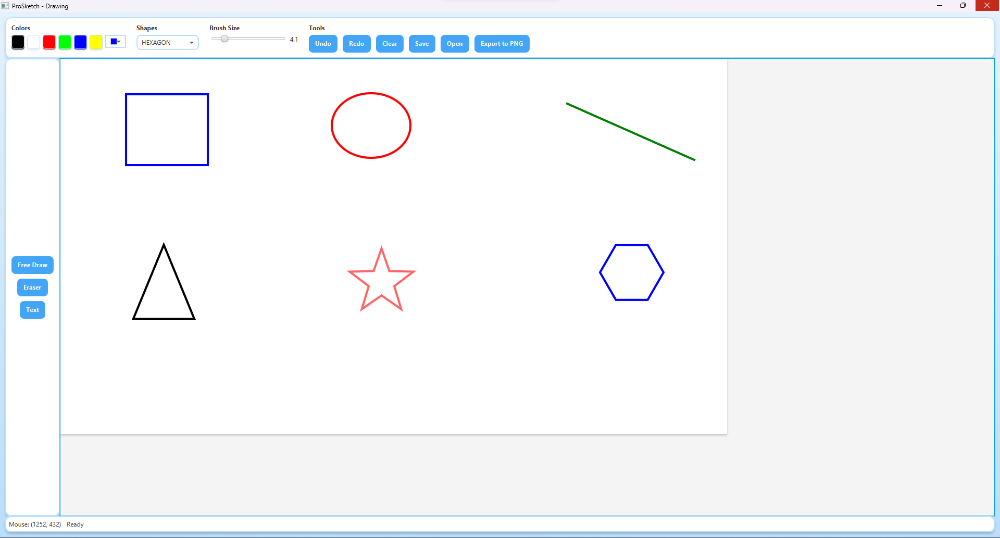
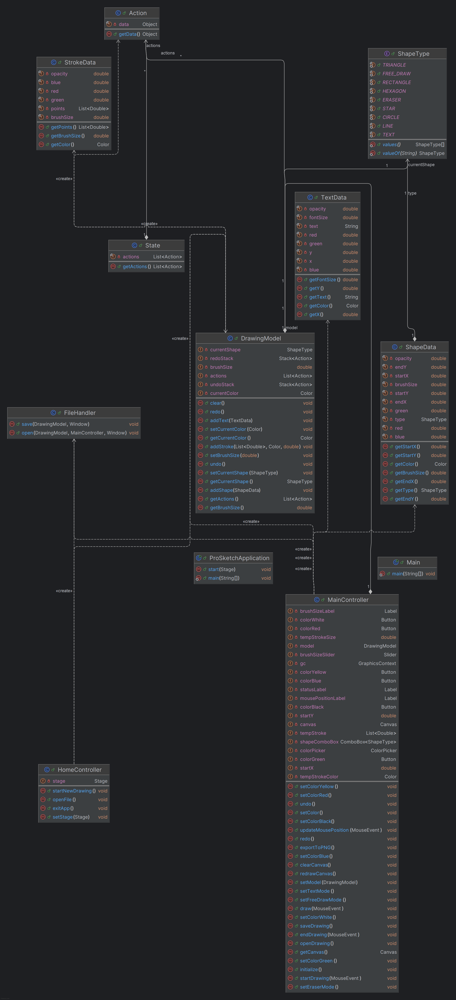

# ProSketch - A JavaFX Drawing Application

ProSketch is a simple yet powerful drawing application built with JavaFX, empowering users to unleash their creativity through a variety of tools like free drawing, geometric shapes, text input, and more. Featuring an intuitive interface, ProSketch supports essential functionalities such as saving/opening files, exporting to PNG, and undo/redo actions, making it an ideal tool for anyone who loves digital drawing or needs a quick sketching app for brainstorming ideas.

This project was developed as the final assignment for the Java course at the ProPTIT (PTIT Programming Club).

---

## Authors
- Hán Đăng (iwillcthew) 

---

## Demo

### Video Demo
Watch the demo video to see ProSketch in action (Click the thumbnail to watch the demo video):  
[](https://youtu.be/69UmZXzzFik)  

### Screenshots
**Home Screen**  
The main interface of ProSketch, where users can start a new drawing, open an existing file, or exit the application.  


**Drawing Screen**  
The drawing interface with a comprehensive toolbar, supporting free drawing, shapes, text input, and more.  


**Shapes Demo**  
Examples of geometric shapes drawn with ProSketch: Rectangle, Circle, Triangle, Star, and Hexagon.  


---

## Features
ProSketch offers a wide range of features to enhance your drawing and file management experience:

- **Home Screen**:
  - Start a new drawing.
  - Open a previously saved drawing file.
  - Exit the application.
- **Drawing Tools**:
  - **Free Drawing**: Draw freely with customizable colors and brush sizes.
  - **Shapes**: Create geometric shapes like Rectangle, Circle, Line, Triangle, Star, and Hexagon.
  - **Text Input**: Add text to your drawing with customizable colors and font sizes.
  - **Eraser**: Erase parts of your drawing, with automatic switching to Free Draw mode when selecting a color.
- **File Operations**:
  - Save drawings in `.psk` format.
  - Open previously saved drawing files.
  - Export drawings as PNG images.
- **Undo/Redo**: Easily undo or redo actions.
- **Customizable Settings**:
  - Change colors using the ColorPicker or predefined color buttons (Black, White, Red, Green, Blue, Yellow).
  - Adjust brush size with a slider (Brush Size Slider).

---

## Requirements
To run ProSketch, ensure you have the following:

- **Java**: Version 17 or higher (this project uses Java 23).
- **Maven**: Version 3.6.3 or higher (for building the project from source).
- **Operating System**: Windows, macOS, or Linux (tested on Windows).

---

## Installation

1. **Download the JAR file**:
   - Get the `ProSketch.jar` file from the [Releases](https://github.com/iwillcthew/ProSketch/releases/) section on GitHub.

2. **Run the JAR file**:
   ```bash
   java -jar ProSketch.jar
   ```
   - Ensure Java 17 or higher is installed on your system.

---

## Project Structure
The directory structure of the ProSketch project is as follows:

```
ProSketch/
├── assets/
│   ├── images/
│   │   ├── home-screen.png        # Screenshot of the Home Screen
│   │   ├── drawing-screen.png     # Screenshot of the Drawing Screen
│   │   ├── shapes-demo.png        # Demo of geometric shapes
│   │   ├── video-thumbnail.png    # Thumbnail for the demo video
│   │   └── uml-diagram.png        # UML diagram of the project
├── src/
│   ├── main/
│   │   ├── java/
│   │   │   ├── com/example/demo/
│   │   │   │   ├── ProSketchApplication.java  # Main class to launch the application
│   │   │   │   ├── HomeController.java       # Controller for the Home Screen
│   │   │   │   └── MainController.java       # Controller for the Drawing Screen
│   │   │   ├── model/
│   │   │   │   ├── Action.java               # Class to store actions (for undo/redo)
│   │   │   │   ├── DrawingModel.java         # Main model to manage drawings
│   │   │   │   ├── ShapeData.java            # Data for geometric shapes
│   │   │   │   ├── ShapeType.java            # Enum defining shape types
│   │   │   │   ├── State.java                # Class to store state (for undo/redo)
│   │   │   │   ├── StrokeData.java           # Data for free drawing strokes
│   │   │   │   └── TextData.java             # Data for text input
│   │   │   ├── controller/
│   │   │   │   └── FileHandler.java          # Handles file saving and opening
│   │   │   └── module-info.java              # Java Module System configuration
│   │   └── resources/
│   │       ├── com/example/demo/
│   │       │   ├── HomeView.fxml             # FXML for the Home Screen
│   │       │   ├── MainView.fxml             # FXML for the Drawing Screen
│   │       │   └── style.css                 # CSS for the UI styling
│   └── test/
│       └── (Currently no test cases)
├── pom.xml                    # Maven configuration file
└── README.md                  # Project documentation
```

---

## UML Diagram
The UML class diagram below illustrates the structure of the ProSketch project, highlighting the main classes and their relationships:



- **ShapeData**: Stores data for geometric shapes (Rectangle, Circle, Line, Triangle, Star, Hexagon).
- **StrokeData**: Stores data for free drawing strokes.
- **TextData**: Stores data for text input.
- **DrawingModel**: Manages the entire drawing, including actions and undo/redo functionality.
- **MainController**: Controls the main drawing interface, handling events like drawing, erasing, text input, etc.

---

## License
[MIT](https://choosealicense.com/licenses/mit/)

---

## Contact
If you have any questions or need assistance, feel free to reach out:  
- **Email**: hanhuudang2206@gmail.com

---

## Acknowledgements
- Thanks to [JavaFX](https://openjfx.io/) for providing a robust library to build user interfaces.
- Thanks to [Maven](https://maven.apache.org/) for dependency management and project building.
- Thanks to the open-source community for inspiring this project.
- Thanks to the ProPTIT for organizing the Java course and providing a platform to learn and grow.
---
